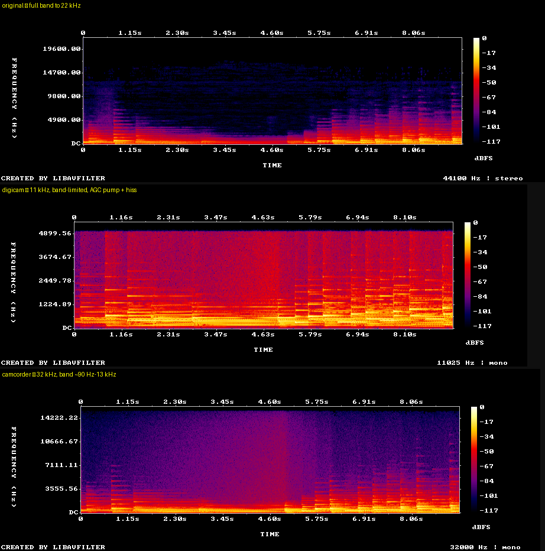

# 📼 digicam2000

**Make any photo or video look like it was shot on a 2-megapixel CCD point-and-shoot in 2002.**

digicam2000 is a *physically-motivated* degrader: instead of slapping on a filter, it
reproduces the artifacts a real early-2000s digicam produced — and applies them **in the
order they actually happened in the imaging chain** (lens → sensor → in-camera processing →
JPEG/codec). Feed it a clean, high-resolution source and the result is hard to tell from a
genuine period clip; the worse the source, the more loss simply stacks.


*source → `sony` / `mpeg_lofi` / `camcorder` — and it does **photos, video, and audio**.*

---

## Install

```bash
pip install git+https://github.com/alexhergomz/Digicam2000.git
# or, from a clone:  pip install .
```

Pulls `numpy`, `pillow`, `typer`. **Video also needs [ffmpeg](https://ffmpeg.org/)**
(`ffmpeg` + `ffprobe`) on your `PATH`. Photos work with no system dependencies. No ImageMagick.

## Quickstart

```bash
digicam2000 photo.jpg                          # -> photo.digicam.jpg
digicam2000 photo.jpg out.jpg -p kodak         # warm, saturated Kodak look
digicam2000 clip.mp4   -p camcorder -d 2002-07-04   # found-footage camcorder + date stamp
digicam2000 --list                             # show every preset
digicam2000 --help
```

Photos and videos are auto-detected by extension. Default output is
`<input>.digicam.<ext>`. Handy flags: `-p/--preset`, `-s/--strength 0–1.5` (photo),
`--mp` (target megapixels), `-d/--datestamp`, `--no-audio`, `--barrel`.

## Presets

**Photo — camera profiles** (modeled on documented brand signatures):

| preset | look |
| --- | --- |
| `digicam` *(default)* | typical 2 MP CCD — warm, punchy, balanced |
| `kodak` | Kodak Color Science — warm, very saturated, punchy reds |
| `sony` | Cyber-shot — neutral/cool, contrasty, heavily sharpened |
| `canon` | PowerShot — clean, slightly warm, balanced |
| `nikon` | Coolpix — crisp, slightly cool/green |
| `fuji` | FinePix Super CCD — vivid, smooth highlight roll-off |

**Photo — scene modes:** `daylight`, `flash` (hot center, dark falloff), `lofi`
(noisy high-ISO), `camcorder` (low-res still grab).

**Video:** `digicam` (MJPEG 640×480 movie mode + IMA-ADPCM), `sony` (Cyber-shot 320×240
MPEG movie), `camcorder` (interlaced MiniDV 720×480 + low-light grain), `mpeg_lofi`
(macroblocked 320×240 MPEG-4). Each degrades audio too.

---

## How it works

Every artifact is tied to its real cause and applied in imaging order:

| stage | real cause | what it does |
| --- | --- | --- |
| **Lens** | cheap zoom optics, lateral CA, light falloff | subtle barrel distortion, **radial** R/B fringing, vignetting |
| **CCD highlights** | low dynamic range, halation | two-scale **bloom** + soft highlight roll-off |
| **CCD smear** | a saturated photosite leaks charge down its column | the signature **vertical purple streak** |
| **Bayer CFA** | one color sampled per pixel, interpolated | softening + false-color "zipper" on edges |
| **Noise** | photon shot noise (σ∝√signal) + read floor | signal-dependent grain, chroma blotches worst in shadows |
| **In-camera ISP** | weak auto-WB, punchy matrix, sharpening, chroma NR | color cast, oversaturation, edge halos, color smear |
| **JPEG / codec** | low-quality 4:2:0; period video codecs | 8×8 blocking, chroma bleed; MJPEG / DV / MPEG |
| **Audio** *(video)* | tiny electret mic, cheap ADC, AGC | mono, band-limit (tinny), AGC pumping, hiss, bit-crush |

A few details that make it convincing rather than cartoonish:

- **Order is physical.** Photo: `optics (CA, distortion, vignette) → sensor sampling →
  bloom/smear/clip/noise → demosaic → white-balance → tone/sharpen → JPEG`. Light-physics
  steps (vignette, bloom, smear, shot noise) run in **linear light**; tone, color and
  sharpening run display-referred, like a real ISP.
- **Chromatic aberration is radial and small** — zero at the center, a couple of pixels at
  the corners (not a uniform whole-frame shift, and not the cartoon 10 px some filters use).
- **Light-source–aware bloom & smear.** Highlights are found by *brightness **and**
  contrast* (local prominence), so the sun/a lamp/a lit window glows and smears even on a
  dark night scene, while a flat bright sky does not.
- **Video reads as captured, not "filtered HD"**: 4:3 crop (a 4:3 sensor cropped the FOV,
  it didn't squish 16:9), motion blur for low-fps capture, limited-DR curve, optical
  softness — and the `camcorder` profile lifts shadows into low-light grain (real AGC
  gain-up) so dark scenes don't look pristine.
- **Audio in capture order**: mic self-noise is added *before* the AGC, so the AGC actually
  pumps the noise floor up in quiet passages (the "breathing" tell); the ADC bit-crush and
  sample-rate come after.

Background reading behind the model: CCD color & highlight roll-off
([dpreview vertical smear](https://www.dpreview.com/forums/thread/2848955),
[purple fringing vs CA](https://www.dpreview.com/forums/threads/purple-fringing-vs-chromatic-aberration.1648620/)),
realistic CA magnitude ([Imatest](https://www.imatest.com/docs/sfr_chromatic/)),
[chroma subsampling](https://en.wikipedia.org/wiki/Chroma_subsampling).

---

## Examples

### Video


GIFs are silent — the rendered clips have **degraded audio too**. Grab the MP4s
(▶ with sound): [`bbb.camcorder`](examples/bbb.camcorder.mp4) ·
[`bbb.sony`](examples/bbb.sony.mp4) · [`tos.camcorder`](examples/tos.camcorder.mp4) ·
[`tos.sony`](examples/tos.sony.mp4) — and the rest in [`examples/`](examples/).

### Audio

It degrades sound alone, through the same built-in-mic chain (mono → hiss →
band-limit → AGC pumping → ADC bit-crush). On a public-domain Beethoven recording:



▶ [original](examples/audio/piano.original.mp3) ·
[digicam](examples/audio/piano.digicam.mp3) ·
[camcorder](examples/audio/piano.camcorder.mp3) ·
[sony](examples/audio/piano.sony.mp3)

```bash
digicam2000 song.wav -p digicam      # -> song.digicam.wav  (11 kHz, AGC-pumped, gritty)
```

### Reproduce

`bash examples/make_examples.sh` rebuilds the video examples (CC BY 3.0 Blender films,
fetched on the fly — see [`examples/CREDITS.md`](examples/CREDITS.md)). `bash test/run.sh`
downloads public test data (Kodak suite, Wikimedia CC clips) and renders the development
validation montages.

## License

[MIT](LICENSE). Example video is CC BY 3.0 © Blender Foundation; the audio example is
public domain — see [`examples/CREDITS.md`](examples/CREDITS.md).
